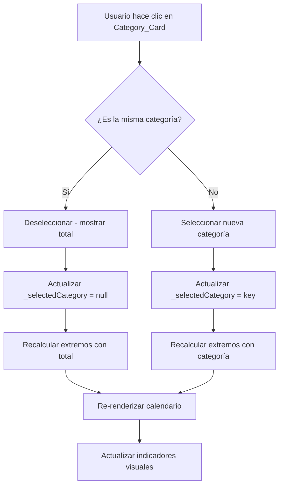

# Design Document: Filtro por Categoría en Calendario de Fogaza

## Overview

Esta funcionalidad permite al usuario filtrar la visualización del calendario de ventas de Fogaza (UDN 6) por categoría específica. Al hacer clic en una de las 9 categorías del desglose, el calendario mostrará los valores de esa categoría en lugar del total general, recalculando los indicadores de máximo/mínimo.

## Architecture

La implementación se realiza completamente en el frontend, modificando únicamente el archivo `calendario.js`. No se requieren cambios en el backend ya que los datos de categorías ya están disponibles en el objeto `ventas` de cada día.



## Components and Interfaces

### Estado de la Clase SalesCalendar

```javascript
class SalesCalendar extends Templates {
    constructor(link, div_modulo) {
        super(link, div_modulo);
        this.PROJECT_NAME = "SalesCalendar";
        this._ventasData = [];
        this._extremes = { ventas: {}, cheque: {}, clientes: {} };
        this._maxVentaGlobal = 0;
        this._selectedCategory = null;  // NUEVO: categoría seleccionada
    }
}
```

### Método: selectCategory(categoryKey)

Maneja la selección/deselección de categorías.

```javascript
selectCategory(categoryKey) {
    if (this._selectedCategory === categoryKey) {
        this._selectedCategory = null;
    } else {
        this._selectedCategory = categoryKey;
    }
    
    this._extremes = this.getWeeklyExtremes(this._ventasData, this._selectedCategory);
    this._maxVentaGlobal = this.calculateMaxVenta(this._selectedCategory);
    
    this.updateCalendarDisplay();
    this.updateCategorySelection();
}
```

### Método: getWeeklyExtremes(data, categoryKey = null)

Modificación del método existente para soportar filtrado por categoría.

```javascript
getWeeklyExtremes(data, categoryKey = null) {
    const dias = ["Lunes", "Martes", "Miércoles", "Jueves", "Viernes", "Sábado", "Domingo"];
    const extremes = { ventas: {}, cheque: {}, clientes: {} };

    dias.forEach(d => {
        const diasSemana = data.filter(el => moment(el.fecha).format('dddd') === d);

        const ventas = diasSemana.map(el => {
            if (categoryKey && el.ventas) {
                return parseFloat(el.ventas[categoryKey]) || 0;
            }
            return parseFloat(el.total) || 0;
        }).filter(v => v > 0);

        extremes.ventas[d] = { 
            max: ventas.length ? Math.max(...ventas) : 0, 
            min: ventas.length ? Math.min(...ventas) : 0 
        };
    });

    return extremes;
}
```

### Método: getDayValue(dia)

Obtiene el valor a mostrar según la categoría seleccionada.

```javascript
getDayValue(dia) {
    if (this._selectedCategory && dia.ventas) {
        return parseFloat(dia.ventas[this._selectedCategory]) || 0;
    }
    return parseFloat(dia.total) || 0;
}
```

### Método: renderFogazaBreakdown() - Modificado

Actualización para hacer las cards clickeables y mostrar indicadores de selección.

```javascript
renderFogazaBreakdown() {
    const categorias = {
        abarrotes: { nombre: 'Abarrotes', icon: '🛒', color: 'from-blue-50 to-blue-100', textColor: 'text-blue-700', ringColor: 'ring-blue-400' },
        bizcocho: { nombre: 'Bizcocho', icon: '🥐', color: 'from-amber-50 to-amber-100', textColor: 'text-amber-700', ringColor: 'ring-amber-400' },
        // ... resto de categorías con ringColor
    };

    let cardsHtml = '';
    Object.keys(categorias).forEach(key => {
        const cat = categorias[key];
        const isSelected = this._selectedCategory === key;
        const selectedClass = isSelected ? `ring-2 ${cat.ringColor} shadow-lg scale-105` : '';
        
        cardsHtml += `
            <div class="category-card bg-gradient-to-br ${cat.color} rounded-xl p-3 shadow-sm 
                        hover:shadow-md transition-all duration-200 border border-gray-100 
                        cursor-pointer ${selectedClass}"
                 data-category="${key}"
                 onclick="calendar.selectCategory('${key}')">
                <!-- contenido de la card -->
            </div>
        `;
    });

    // Botón "Ver todas" condicional
    const resetButton = this._selectedCategory ? `
        <button onclick="calendar.selectCategory(null)" 
                class="text-sm text-blue-600 hover:text-blue-800 font-medium">
            ✕ Ver todas
        </button>
    ` : '';

    // Header con nombre de categoría seleccionada
    const headerText = this._selectedCategory 
        ? `Filtrando: ${categorias[this._selectedCategory].nombre}`
        : 'Desglose de Ventas - Fogaza';
}
```

## Data Models

### Estructura de datos existente (sin cambios)

```javascript
// Cada día en _ventasData tiene esta estructura:
{
    dia: "15",
    mes: "01",
    fecha: "2025-01-15",
    total: 15000.50,
    totalFormateado: "$15,000.50",
    clientes: 120,
    chequePromedio: "$125.00",
    ventas: {
        abarrotes: 1500.00,
        bizcocho: 3200.50,
        bocadillos: 800.00,
        frances: 2100.00,
        pasteleria_normal: 2500.00,
        pasteleria_premium: 1800.00,
        refrescos: 1200.00,
        souvenirs: 900.00,
        velas: 1000.00
    }
}
```

## Correctness Properties

*A property is a characteristic or behavior that should hold true across all valid executions of a system-essentially, a formal statement about what the system should do. Properties serve as the bridge between human-readable specifications and machine-verifiable correctness guarantees.*

### Property 1: Selección de categoría muestra valores correctos

*For any* día del calendario y *for any* categoría seleccionada, el valor mostrado en el Day_Card debe ser igual al valor de `dia.ventas[selectedCategory]` formateado con `formatPrice()`.

**Validates: Requirements 1.1, 1.3, 6.1, 6.2**

### Property 2: Cálculo de extremos por categoría

*For any* categoría seleccionada, los valores máximo y mínimo calculados deben corresponder exactamente al máximo y mínimo de los valores de esa categoría en todos los días del calendario, agrupados por día de la semana.

**Validates: Requirements 4.1, 4.3**

### Property 3: Persistencia de estado según UDN

*For any* secuencia de operaciones donde la UDN permanece en 6, la categoría seleccionada debe mantenerse. *For any* cambio de UDN, la categoría seleccionada debe resetearse a null.

**Validates: Requirements 5.1, 5.2, 5.3**

### Property 4: Reset a vista total

*For any* estado con categoría seleccionada, al ejecutar `selectCategory(null)`, el calendario debe mostrar los valores de `dia.total` y los extremos deben calcularse sobre el total general.

**Validates: Requirements 3.2, 4.3**

## Error Handling

| Escenario | Manejo |
|-----------|--------|
| `dia.ventas` es undefined | Retornar 0 y mostrar "-" |
| `dia.ventas[category]` es undefined | Retornar 0 y mostrar "$0.00" |
| Categoría inválida | Ignorar y mantener estado actual |
| UDN cambia mientras hay categoría seleccionada | Resetear `_selectedCategory` a null |

## Testing Strategy

### Unit Tests (Ejemplos específicos)

1. **Test de indicador visual**: Verificar que al seleccionar "bizcocho", la card tenga las clases `ring-2 ring-amber-400 shadow-lg`
2. **Test de botón "Ver todas"**: Verificar que el botón aparece solo cuando hay categoría seleccionada
3. **Test de header dinámico**: Verificar que el texto del header cambia según la categoría

### Property-Based Tests

Cada propiedad debe implementarse como un test con mínimo 100 iteraciones usando datos generados aleatoriamente.

**Configuración recomendada:**
- Librería: fast-check (JavaScript)
- Generadores: Días con ventas aleatorias por categoría
- Iteraciones: 100 mínimo por propiedad

**Tag format:** Feature: filtro-categoria-calendario-fogaza, Property {number}: {property_text}

### Casos de prueba manuales

1. Seleccionar categoría → verificar valores en calendario
2. Cambiar de categoría → verificar actualización
3. Clic en "Ver todas" → verificar reset
4. Cambiar UDN → verificar reset de selección
5. Volver a UDN 6 → verificar que no hay selección previa
