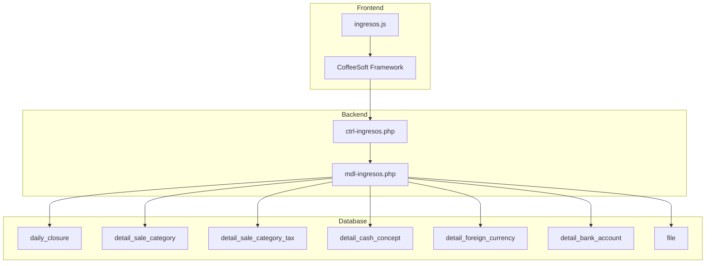
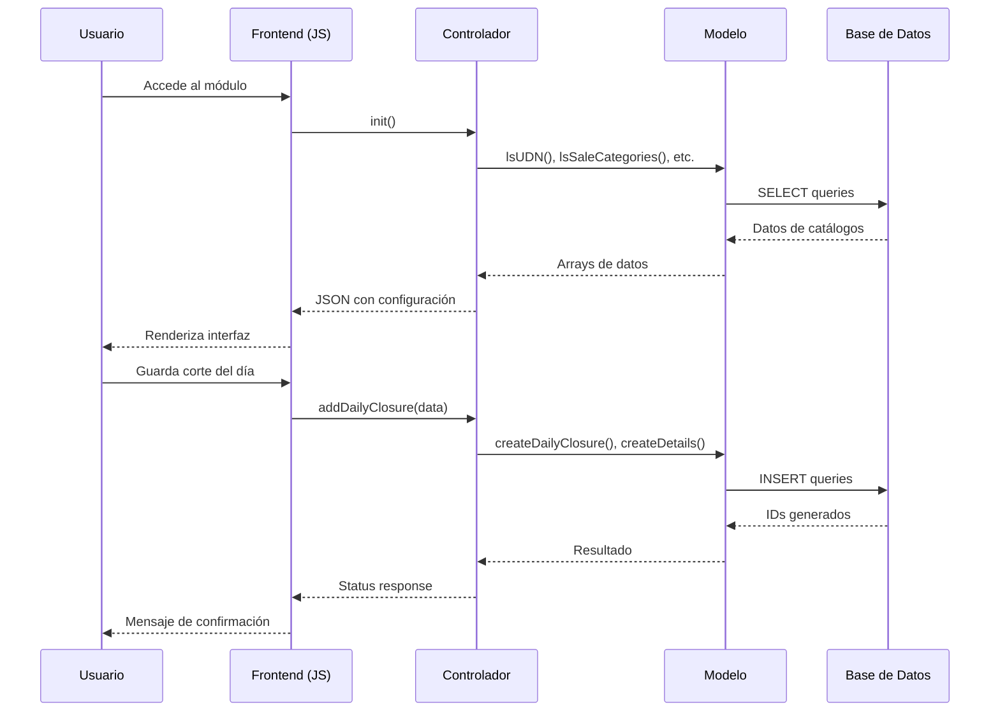

# Design Document - Módulo de Ingresos (Ventas)

## Overview

El módulo de Ingresos permite la gestión completa de ventas diarias por unidad de negocio dentro del sistema de Contabilidad. Implementa un flujo CRU (Create, Read, Update) para el registro de cortes del día, incluyendo ventas por categoría, descuentos, cortesías, impuestos y múltiples formas de pago.

El sistema se integra con la base de datos `rfwsmqex_gvsl_finanzas3` y utiliza el framework CoffeeSoft para la interfaz de usuario, siguiendo el patrón MVC establecido en el proyecto.

## Architecture



### Flujo de Datos



## Components and Interfaces

### Frontend (ingresos.js)

```javascript
// Estructura de clases
class App extends Templates {
    constructor(link, div_modulo)
    render()
    layout()
    filterBar()
}

class Ingresos extends Templates {
    constructor(link, div_modulo)
    render()
    layoutIngresos()
    filterBarIngresos()
    showResumen()
    addDailyClosure()
    editDailyClosure(id)
    jsonFormVentas()
    jsonFormPagos()
    calculateTotals()
    uploadFiles(dailyClosureId)
    importSoftRestaurant()
}
```

### Controlador (ctrl-ingresos.php)

```php
class ctrl extends mdl {
    // Inicialización
    function init()
    
    // Consultas
    function showDailyClosure()
    function getDailyClosure()
    
    // Operaciones CRUD
    function addDailyClosure()
    function editDailyClosure()
    
    // Archivos
    function uploadFile()
    
    // Integración
    function importSoftRestaurant()
    
    // Validaciones
    function validateSchedule()
}
```

### Modelo (mdl-ingresos.php)

```php
class mdl extends CRUD {
    // Catálogos
    function lsUDN()
    function lsSaleCategories($array)
    function lsCashConcepts($array)
    function lsForeignCurrencies()
    function lsBankAccounts($array)
    function lsEmployees($array)
    
    // Daily Closure
    function getDailyClosureById($array)
    function getDailyClosureByDate($array)
    function createDailyClosure($array)
    function updateDailyClosure($array)
    
    // Detalles
    function createDetailSaleCategory($array)
    function updateDetailSaleCategory($array)
    function listDetailSaleCategory($array)
    
    function createDetailSaleCategoryTax($array)
    function updateDetailSaleCategoryTax($array)
    
    function createDetailCashConcept($array)
    function updateDetailCashConcept($array)
    function listDetailCashConcept($array)
    
    function createDetailForeignCurrency($array)
    function updateDetailForeignCurrency($array)
    function listDetailForeignCurrency($array)
    
    function createDetailBankAccount($array)
    function updateDetailBankAccount($array)
    function listDetailBankAccount($array)
    
    // Archivos
    function createFile($array)
    function listFilesByDailyClosure($array)
    
    // Validaciones
    function getModuleLock($array)
    
    // Totales
    function getDailyClosureTotals($array)
}
```

## Data Models

### Tabla: daily_closure

| Campo | Tipo | Descripción |
|-------|------|-------------|
| id | int | PK, auto_increment |
| udn_id | int | FK a udn |
| employee_id | int | FK a empleados (jefe de turno) |
| total_sale_without_tax | decimal(12,2) | Total ventas sin impuestos |
| total_sale | decimal(12,2) | Total ventas con impuestos |
| subtotal | decimal(12,2) | Subtotal |
| tax | decimal(12,2) | Impuestos |
| cash | decimal(12,2) | Total efectivo |
| banks | decimal(12,2) | Total bancos |
| credit_consumer | decimal(12,2) | Crédito otorgado |
| credit_payment | decimal(12,2) | Pagos de crédito |
| total_payment | decimal(12,2) | Total pagado |
| difference | decimal(12,2) | Diferencia |
| created_at | date | Fecha del corte |
| turn | enum | Turno (Matutino/Vespertino) |
| total_suite | tinyint | Total suites ocupadas |

### Tabla: detail_sale_category

| Campo | Tipo | Descripción |
|-------|------|-------------|
| id | int | PK |
| sale | decimal(12,2) | Monto de venta |
| net_sale | decimal(12,2) | Venta neta |
| discount | decimal(12,2) | Descuento |
| courtesy | decimal(12,2) | Cortesía |
| daily_closure_id | int | FK a daily_closure |
| sale_category_id | int | FK a sale_category |

### Tabla: detail_cash_concept

| Campo | Tipo | Descripción |
|-------|------|-------------|
| id | int | PK |
| daily_closure_id | int | FK a daily_closure |
| cash_concept_id | int | FK a cash_concept |
| amount | decimal(12,2) | Monto |

### Tabla: detail_foreign_currency

| Campo | Tipo | Descripción |
|-------|------|-------------|
| id | int | PK |
| foreing_currency_id | int | FK a foreign_currency |
| exchange_rate | decimal(12,2) | Tipo de cambio |
| amount | decimal(12,2) | Monto en moneda extranjera |
| amount_mxn | decimal(12,2) | Monto en MXN |
| daily_closure_id | int | FK a daily_closure |

### Tabla: detail_bank_account

| Campo | Tipo | Descripción |
|-------|------|-------------|
| id | int | PK |
| daily_closure_id | int | FK a daily_closure |
| bank_account_id | int | FK a bank_account |
| amount | decimal(12,2) | Monto |

### Estructura de Datos del Formulario

```javascript
// Datos de ventas del día
const ventasData = {
    turn: 'Matutino',
    employee_id: 1,
    total_suite: 5,
    categories: [
        { sale_category_id: 1, sale: 19092.99, discount: 182.87, courtesy: 0 },
        { sale_category_id: 2, sale: 4824.07, discount: 0, courtesy: 83.33 },
        { sale_category_id: 3, sale: 0, discount: 0, courtesy: 0 },
        { sale_category_id: 4, sale: 0, discount: 0, courtesy: 0 }
    ],
    tax_rate: 0.08
};

// Datos de formas de pago
const pagosData = {
    cash_concepts: [
        { cash_concept_id: 1, amount: 1312.25 },  // Propina
        { cash_concept_id: 2, amount: 11692.5 },  // Efectivo
        { cash_concept_id: 3, amount: 0 }         // Vales
    ],
    foreign_currencies: [
        { foreing_currency_id: 1, amount: 0, exchange_rate: 17.5 },  // Dólar
        { foreing_currency_id: 2, amount: 0, exchange_rate: 2.3 }    // Quetzal
    ],
    bank_accounts: [
        { bank_account_id: 1, amount: 6558.05 },
        { bank_account_id: 2, amount: 0 },
        { bank_account_id: 3, amount: 0 },
        { bank_account_id: 4, amount: 0 },
        { bank_account_id: 5, amount: 13442.25 }
    ],
    credit: {
        consumer: 1720.00,
        payment: 6558.05
    }
};
```

## Correctness Properties

*A property is a characteristic or behavior that should hold true across all valid executions of a system-essentially, a formal statement about what the system should do. Properties serve as the bridge between human-readable specifications and machine-verifiable correctness guarantees.*

### Property 1: Integridad de Cálculos de Totales de Ventas

*For any* conjunto de valores de ventas por categoría (Alimentos, Bebidas, Diversos, Descorche), el Total de Ventas calculado SHALL ser exactamente igual a la suma aritmética de todos los valores de categoría.

**Validates: Requirements 4.1**

### Property 2: Integridad de Cálculos de Descuentos

*For any* conjunto de valores de descuentos y cortesías, el Total de Descuentos y Cortesías calculado SHALL ser exactamente igual a la suma de todos los descuentos y cortesías individuales.

**Validates: Requirements 4.2**

### Property 3: Cálculo Correcto de IVA

*For any* valor de ventas netas (Ventas - Descuentos), el IVA calculado SHALL ser exactamente igual a (Ventas - Descuentos) * 0.08, con precisión de 2 decimales.

**Validates: Requirements 2.4, 4.3**

### Property 4: Integridad del Total de Venta

*For any* combinación de Ventas, Descuentos e Impuestos, el Total de Venta SHALL ser exactamente igual a: Ventas - Descuentos + Impuestos.

**Validates: Requirements 4.4**

### Property 5: Integridad de Cálculos de Pagos

*For any* conjunto de pagos (Efectivo, Bancos, Créditos), el Total Pagado SHALL ser exactamente igual a: Total Efectivo + Total Bancos - (Crédito Consumos - Crédito Pagos).

**Validates: Requirements 4.5, 4.6, 4.7, 4.8**

### Property 6: Cálculo Correcto de Diferencia

*For any* valores de Total de Venta y Total Pagado, la Diferencia SHALL ser exactamente igual a: Total Pagado - Total de Venta.

**Validates: Requirements 4.9**

### Property 7: Persistencia de Datos de Corte

*For any* corte del día guardado exitosamente, al consultar el registro por ID, todos los campos SHALL contener exactamente los mismos valores que fueron enviados en la operación de guardado.

**Validates: Requirements 2.8, 3.7**

### Property 8: Validación de Horario de Captura

*For any* intento de registro o edición fuera del horario permitido según monthly_module_lock, el sistema SHALL rechazar la operación y retornar un error con status diferente a 200.

**Validates: Requirements 2.9, 9.2**

### Property 9: Control de Acceso por Rol

*For any* usuario con rol específico (Gerente, Auxiliar, Contable, Developer), las operaciones permitidas SHALL corresponder exactamente a los permisos definidos para ese rol.

**Validates: Requirements 8.1, 8.2, 8.3, 8.4**

### Property 10: Validación de Tipos de Archivo

*For any* archivo subido al sistema, la extensión SHALL estar dentro del conjunto permitido: {PDF, PNG, JPG, JPEG, XLSX}. Archivos con extensiones fuera de este conjunto SHALL ser rechazados.

**Validates: Requirements 5.3**

### Property 11: Registro Completo de Archivos

*For any* archivo subido exitosamente, el registro en la tabla file SHALL contener todos los campos requeridos: file_name, size_bytes, path, extension, created_at, section_id=1, user_id, udn_id, daily_closure_id.

**Validates: Requirements 5.4**

### Property 12: Consistencia de Datos de Resumen

*For any* consulta de resumen de ventas del día, la suma de los componentes individuales (ventas por categoría, descuentos, impuestos) SHALL ser igual a los totales mostrados en el resumen.

**Validates: Requirements 1.1, 1.2**

## Error Handling

### Errores de Validación

| Código | Mensaje | Causa |
|--------|---------|-------|
| 400 | "Datos incompletos" | Campos requeridos vacíos |
| 400 | "Formato de fecha inválido" | Fecha no válida |
| 400 | "Valores numéricos inválidos" | Montos negativos o no numéricos |

### Errores de Negocio

| Código | Mensaje | Causa |
|--------|---------|-------|
| 403 | "Fuera del horario permitido para captura" | Intento fuera de horario |
| 403 | "No tiene permisos para esta acción" | Rol sin permisos |
| 409 | "Ya existe un registro para esta fecha" | Duplicado de corte |

### Errores de Sistema

| Código | Mensaje | Causa |
|--------|---------|-------|
| 500 | "Error al guardar el registro" | Fallo en INSERT/UPDATE |
| 500 | "Error de conexión con Soft-Restaurant" | Integración fallida |
| 500 | "Error al subir archivo" | Fallo en upload |

## Testing Strategy

### Unit Tests

Los unit tests verificarán:

1. **Cálculos matemáticos**: Funciones de cálculo de totales, IVA, diferencias
2. **Validaciones**: Formato de datos, permisos, horarios
3. **Transformaciones**: Conversión de datos entre frontend y backend

### Property-Based Tests

Se utilizará una librería de property-based testing para PHP/JavaScript para verificar las propiedades definidas:

- **Configuración**: Mínimo 100 iteraciones por propiedad
- **Generadores**: Valores aleatorios para montos (0 a 999999.99), fechas, IDs
- **Framework**: fast-check para JavaScript

### Integration Tests

1. **Flujo completo de registro**: Crear corte → Verificar persistencia → Consultar datos
2. **Flujo de edición**: Cargar datos → Modificar → Guardar → Verificar cambios
3. **Subida de archivos**: Upload → Verificar registro en BD → Verificar archivo físico

### Test Coverage

| Componente | Cobertura Objetivo |
|------------|-------------------|
| Cálculos de totales | 100% |
| Validaciones de negocio | 100% |
| Operaciones CRUD | 90% |
| Integración Soft-Restaurant | 80% |
