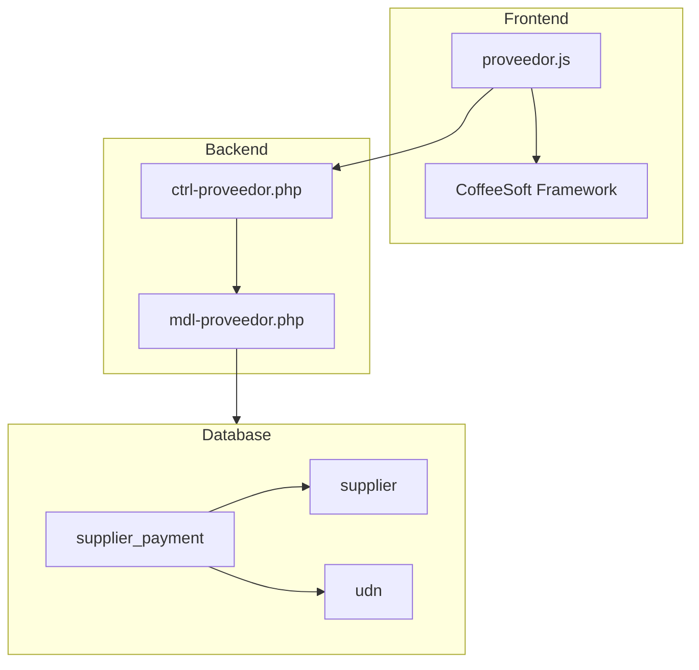
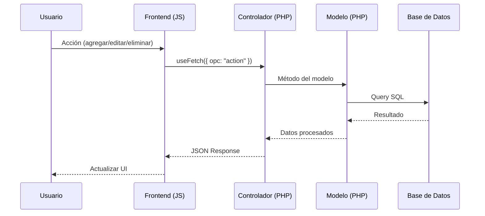

# Design Document: Módulo Pagos a Proveedores

## Overview

El módulo de Pagos a Proveedores es un sistema de gestión financiera que permite registrar, consultar y administrar los pagos realizados a proveedores por cada unidad de negocio. El sistema implementa un modelo de permisos basado en niveles de usuario (1-4) que controla las capacidades de captura, edición y visualización.

El módulo se integra con el sistema de captura existente en `finanzas/captura/` y utiliza el framework CoffeeSoft para la interfaz de usuario, siguiendo los patrones establecidos en el pivote File Manager.

## Architecture



### Flujo de Datos



## Components and Interfaces

### Frontend Components

#### 1. App Class (Clase Principal)
- **Responsabilidad:** Layout principal, tabs, filtros globales
- **Hereda de:** Templates (CoffeeSoft)
- **Métodos principales:**
  - `render()` - Inicializa layout y componentes
  - `layout()` - Estructura con tabs
  - `filterBar()` - Filtros de fecha y UDN

#### 2. Payments Class (Gestión de Pagos)
- **Responsabilidad:** CRUD de pagos a proveedores
- **Hereda de:** Templates (CoffeeSoft)
- **Métodos principales:**
  - `lsPayments()` - Listar pagos del día
  - `addPayment()` - Modal para nuevo pago
  - `editPayment(id)` - Modal para editar pago
  - `deletePayment(id)` - Confirmación y eliminación
  - `renderTotalCards()` - KPIs de totales

#### 3. Consolidated Class (Vista Concentrado)
- **Responsabilidad:** Vista consolidada de compras y pagos
- **Hereda de:** Templates (CoffeeSoft)
- **Métodos principales:**
  - `lsConsolidated()` - Tabla agrupada por proveedor
  - `showPurchaseDetails(supplierId, date)` - Modal detalles compras
  - `showPaymentDetails(supplierId, date)` - Modal detalles pagos
  - `exportToExcel()` - Exportación de datos

### Backend Components

#### 1. Controlador (ctrl-proveedor.php)
```
Métodos:
├── init()           → Datos iniciales (proveedores, tipos pago, UDN, nivel usuario)
├── ls()             → Listar pagos por fecha
├── lsConsolidated() → Concentrado por rango de fechas
├── getPayment()     → Obtener pago por ID
├── addPayment()     → Crear nuevo pago
├── editPayment()    → Actualizar pago existente
├── deletePayment()  → Eliminar pago
└── exportExcel()    → Generar archivo Excel
```

#### 2. Modelo (mdl-proveedor.php)
```
Métodos:
├── listPayments()           → SELECT pagos con filtros
├── listConsolidated()       → SELECT agrupado por proveedor
├── getPaymentById()         → SELECT pago específico
├── createPayment()          → INSERT nuevo pago
├── updatePayment()          → UPDATE pago existente
├── deletePaymentById()      → DELETE pago
├── lsSuppliers()            → SELECT proveedores activos
├── lsPaymentTypes()         → SELECT tipos de pago
├── lsUDN()                  → SELECT unidades de negocio
└── getSupplierBalance()     → Cálculo de saldos
```

### Interfaces de Comunicación

#### Request/Response Format
```javascript
// Request
{
    opc: "ls",
    fi: "2025-12-01",
    ff: "2025-12-11",
    udn: 1
}

// Response
{
    status: 200,
    message: "Datos obtenidos correctamente",
    row: [...],
    totals: {
        total: 1500.00,
        fondoFijo: 26.00,
        corporativo: 1474.00
    }
}
```

## Data Models

### Tablas de Base de Datos

#### supplier
| Campo | Tipo | Descripción |
|-------|------|-------------|
| id | INT (PK) | Identificador único |
| udn_id | INT (FK) | Referencia a unidad de negocio |
| name | VARCHAR(255) | Nombre del proveedor |
| active | TINYINT | Estado (1=activo, 0=inactivo) |

#### supplier_payment
| Campo | Tipo | Descripción |
|-------|------|-------------|
| id | INT (PK) | Identificador único |
| supplier_id | INT (FK) | Referencia al proveedor |
| amount | DECIMAL(10,2) | Monto del pago |
| description | TEXT | Descripción del pago |
| operation_date | DATE | Fecha de operación |
| active | TINYINT | Estado del registro |

### Modelos de Datos Frontend

```javascript
// Payment Object
{
    id: number,
    supplier_id: number,
    supplier_name: string,
    payment_type: string,
    amount: number,
    description: string,
    operation_date: string
}

// Consolidated Row
{
    supplier_id: number,
    supplier_name: string,
    initial_balance: number,
    purchases: number,
    payments: number,
    final_balance: number,
    details: {
        purchases: [...],
        payments: [...]
    }
}
```

## Correctness Properties

*A property is a characteristic or behavior that should hold true across all valid executions of a system-essentially, a formal statement about what the system should do. Properties serve as the bridge between human-readable specifications and machine-verifiable correctness guarantees.*

### Property 1: Payment Validation - Required Fields
*For any* payment submission attempt, if the supplier_id is empty or null, the system should reject the submission and return a validation error without modifying the database.
**Validates: Requirements 1.2, 1.3**

### Property 2: Total Calculation Consistency
*For any* set of payments displayed in the daily view, the total shown in the KPI cards should equal the sum of all individual payment amounts in the table.
**Validates: Requirements 1.5**

### Property 3: Date Filter Accuracy
*For any* selected date, all payments displayed in the table should have an operation_date matching the selected date exactly.
**Validates: Requirements 1.8**

### Property 4: Consolidated Balance Calculation
*For any* supplier in the consolidated view, the final_balance should equal initial_balance plus purchases minus payments for the selected date range.
**Validates: Requirements 2.4**

### Property 5: UDN Filter Isolation
*For any* selected UDN, all displayed payments and suppliers should belong exclusively to that business unit.
**Validates: Requirements 3.2**

### Property 6: Access Control - Read Only Mode
*For any* user with level >= 2, the system should not render edit or delete buttons in the payments table, and API calls to edit/delete endpoints should return access denied.
**Validates: Requirements 3.3, 3.4, 5.1, 5.2**

### Property 7: Supplier Uniqueness
*For any* supplier creation attempt with a name that already exists in the same UDN, the system should reject the creation and return a duplicate error.
**Validates: Requirements 4.3**

### Property 8: Data Round-Trip Consistency
*For any* payment record, storing it to the database and then retrieving it should produce an equivalent object with correctly formatted monetary values.
**Validates: Requirements 6.2**

### Property 9: Monetary Format Consistency
*For any* monetary value displayed in the UI, the format should include currency symbol ($) and exactly two decimal places.
**Validates: Requirements 6.3**

## Error Handling

### Errores de Validación
- **Campos requeridos vacíos:** Mensaje de validación en el formulario
- **Proveedor duplicado:** Mensaje de error con nombre existente
- **Monto inválido:** Validación de formato numérico

### Errores de Permisos
- **Acceso denegado:** Redirección a vista de solo lectura
- **Nivel insuficiente:** Ocultamiento de controles de edición

### Errores de Sistema
- **Error de conexión:** Mensaje de reintento
- **Error de base de datos:** Mensaje genérico sin exponer detalles

## Testing Strategy

### Dual Testing Approach

El módulo implementará tanto pruebas unitarias como pruebas basadas en propiedades para garantizar la correctitud del sistema.

### Unit Tests
- Verificar renderizado correcto de formularios
- Validar comportamiento de modales (abrir/cerrar)
- Comprobar formato de fechas y montos
- Verificar ocultamiento de botones según nivel de usuario

### Property-Based Testing

**Framework:** fast-check (JavaScript)

**Configuración:** Mínimo 100 iteraciones por propiedad

**Propiedades a implementar:**

1. **Property 1:** Generar pagos aleatorios sin supplier_id y verificar rechazo
2. **Property 2:** Generar conjuntos de pagos y verificar suma de totales
3. **Property 3:** Generar fechas aleatorias y verificar filtrado correcto
4. **Property 4:** Generar datos de proveedor y verificar cálculo de balance
5. **Property 5:** Generar UDNs y verificar aislamiento de datos
6. **Property 6:** Generar niveles de usuario y verificar control de acceso
7. **Property 7:** Generar nombres de proveedores y verificar unicidad
8. **Property 8:** Generar pagos, guardar y recuperar, verificar equivalencia
9. **Property 9:** Generar valores monetarios y verificar formato

**Formato de anotación en tests:**
```javascript
// **Feature: modulo-pagos-proveedores, Property 1: Payment Validation - Required Fields**
```

### Integration Tests
- Flujo completo de captura de pago
- Flujo de edición y eliminación
- Cambio de vista entre captura y concentrado
- Exportación a Excel
